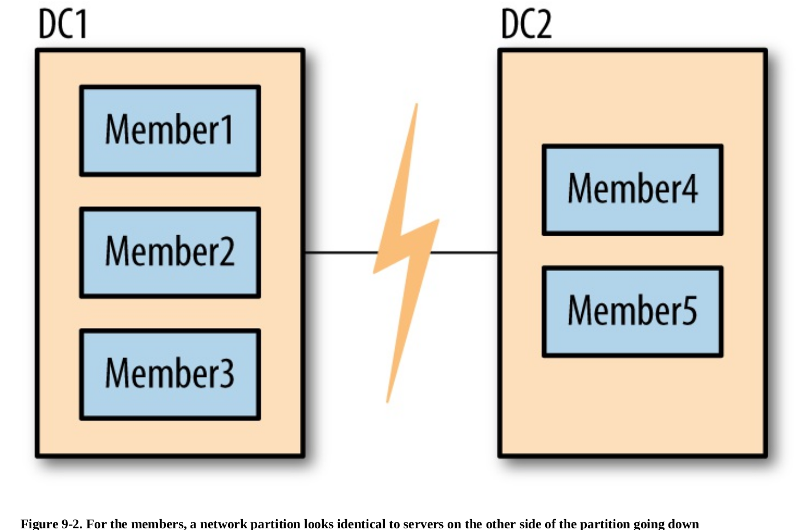

## MongoDB

### Replication
With MongoDB, you set up replication by creating a replica set. A replica set is a group of
servers with one primary, the server taking client requests, and multiple secondaries, servers that
keep copies of the primary’s data. If the primary crashes, the secondaries can elect a new primary
from amongst themselves.

#### Setting up replica set
```sh
mkdir -p ~/data/rs{1,2,3}
mongod --replSet mdbDefGuide --dbpath ~/data/rs1 --port 27017 --smallfiles --oplogSize 200
mongod --replSet mdbDefGuide --dbpath ~/data/rs2 --port 27018 --smallfiles --oplogSize 200
mongod --replSet mdbDefGuide --dbpath ~/data/rs3 --port 27019 --smallfiles --oplogSize 200
```
At this stage, each mongod does not yet know that the others exist. To tell them about one
another, we need to create a configuration that lists each of the members and send this
configuration to one of our mongod processes. It will take care of propagating the configuration
to the other members.

First, connect to mongod using shell:
```
mongo --port 27017
```

Then, in shell execute following
```js
rsconf = {
  _id: "mdbDefGuide",
  members: [
  {_id: 0, host: "localhost:27017"},
  {_id: 1, host: "localhost:27018"},
  {_id: 2, host: "localhost:27019"}
  ]
  }

rs.initiate(rsconf)
```
Unfortunately, you cannot convert a standalone server to a replica set without some downtime
for restarting it and initializing the set. Thus, even if you only have one server to start out with,
you may want to configure it as a one-member replica set. That way, if you want to add more
members later, you can do so without downtime.

If you are starting a brand-new set, you can send the configuration to any member in the set. If
you are starting with data on one of the members, you must send the configuration to the member
with data. You cannot initiate a set with data on more than one member.

#### Observing replication
Once initiated, you should have a fully functional replica set. The replica set should elect a
primary. You can view the status of replica set using rs.status() . The output from rs.status()
tells you quite a bit about the replica set
```js
rs.status()
```

or
```js
db.isMaster()
```
isMaster is a very old command, predating replica sets to when MongoDB only supported
master-slave replication. Thus, it does not use the replica set terminology consistently: it still
calls the primary a “master.” You can generally think of “master” as equivalent to “primary” and
“slave” as equivalent to “secondary.”

Let's create some data. First, connect to the primary
```sh
mongo --port 27017
```

Then, execute in shell
```js
use test
for (i=0; i<1000; i++) {db.coll.insert({count: i})}
```

#### Read from replica
In master shell execute
```js
secondaryConn = new Mongo("localhost:27019")
secondaryDB = secondaryConn.getDB("test")
secondaryConn.setSlaveOk()
secondaryDB.coll.find()
```

#### Failover
Let's simulate fail of master node
```js
db.adminCommand({"shutdown" : 1})
```

After this primary node will go down and two other nodes will elect new primary. We could check which
node is primary by executing
```js
db.isMaster().primary
```

#### Replica Set Configuration
To add a new member to the set, you can use rs.add :
```js
rs.add("localhost:27020")
```
Similarly, you can remove members:
```js
rs.remove("localhost:27017")
```

You can check that a reconfiguration succeeded:
```js
rs.config()
```

You can also modify existing members, not just add and remove them. To make modifications,
create the configuration document that you want in the shell and call rs.reconfig . For example
```js
var config = rs.config()
config.members[0].host = "localhost:27017"
rs.reconfig(config)
```

### Majority
To plan out your set, there are certain replica set concepts that you must be familiar with. The
next chapter goes into more detail about these, but the most important is that replica sets are all
about majorities: you need a majority of members to elect a primary, a primary can only stay
primary as long as it can reach a majority, and a write is safe when it’s been replicated to a
majority. This majority is defined to be “more than half of all members in the set”.

Many users find this frustrating: why can’t the two remaining members elect a primary? The
problem is that it’s possible that the other three members didn’t go down, and that it was the
network that went down, as shown in Figure 9-2. In this case, the three members on the left will
elect a primary, since they can reach a majority of the set (three members out of five).



In the case of a network partition, we do not want both sides of the partition to elect a primary:
otherwise the set would have two primaries. Then both primaries would be writing to the data
and the data sets would diverge. Requiring a majority to elect or stay primary is a neat way of
avoiding ending up with more than one primary.

#### Elections
When a secondary cannot reach a primary, it will contact all the other members and request that
it be elected primary. These other members do several sanity checks: Can they reach a primary
that the member seeking election cannot? Is the member seeking election up to date with
replication? Is there anyone with a higher priority available who should be elected instead?

If a member seeking election receives “ayes” from a majority of the set, it becomes primary. If
even one server vetoes the election, the election is canceled. A member vetoes an election when
it knows any reason that the member seeking election shouldn’t become primary.

The member seeking election (the candidate) must be up to date with replication, as far as the
members it can reach know. All replicated operations are strictly ordered by ascending
timestamp, so the candidate must have operations later than or equal to any member it can reach.

For example, suppose that the latest operation that the candidate has replicated is op 123. It
contacts the other members of the set and one of them has replicated up to operation 124. That
member will veto the candidate’s election. The candidate will continue syncing and once it has
synced operation 124, it will call for an election again (if no one else has become primary in that
time). This time around, assuming nothing else is wrong with candidate, the member that
previously vetoed the election will vote for the candidate.
Assuming that the candidate receives “ayes” from a majority of voters, it will transition into
primary state.

#### Arbiters
MongoDB supports a special type of member called an arbiter, whose
only purpose is to participate in elections. Arbiters hold no data and aren’t used by clients: they
just provide a majority for two-member sets.

You start up an arbiter in the same way that you start a normal mongod, using the --replSet
option and an empty data directory. You can add it to the set using the rs.addArb() helper:
```js
rs.addArb("server-5:27017")
```
Equivalently, you can specify the arbiterOnly option in the member configuration:
```js
rs.add({"_id" : 4, "host" : "server-5:27017", "arbiterOnly" : true})
```

#### Priority
Priority is how strongly this member “wants” to become primary. Priority can range from 0 to
100 and the default is 1. Setting priority to 0 has a special meaning: members with 0 priority can
never become primary. These members are called passive members.

#### Hidden
Clients do not route requests to hidden members and hidden members are not preferred as
replication sources (although they will be used if more desirable sources are not available). Thus,
many people will hide less powerful or backup servers.

For example, suppose you had a set that looked like this:
```js
rs.isMaster()
  {
  ...
  "hosts" : [
  "server-1:27107",
  "server-2:27017",
  "server-3:27017"
  ],
  ...
  }
```

To hide server-3, add the hidden: true field to its configuration. A member must have a priority
of 0 to be hidden (you can’t have a hidden primary):
```js
var config = rs.config()
config.members[2].hidden = 0
config.members[2].priority = 0
rs.reconfig(config)
```

Now running isMaster() will show:
```js
rs.isMaster()
  {
  ...
  "hosts" : [
  "server-1:27107",
  "server-2:27017"
  ],
  ...
  }
```

rs.status() and rs.config() will still show the member; it only disappears from isMaster() . When
clients connect to a replica set, they call isMaster() to determine the members of the set. Thus,
hidden members will never be used for read requests.

To unhide a member, change the hidden option to false or remove the option entirely.

#### Delayed secondary
A delayed secondary purposely lags by the specified number of seconds. This way, if someone
fat-fingers away your main collection, you can restore it from an identical copy of the data from
earlier.

slaveDelay requires the member’s priority to be 0. If your application is routing reads to
secondaries, you should make slave delayed members hidden so that reads are not routed to
them.

To configure a delayed secondary member, set its members[n].priority value to 0, its members[n].hidden value to true, and its members[n].slaveDelay value to the number of seconds to delay.

The following example sets a 1-hour delay on a secondary member currently at the index 0 in the members array.
```js
cfg = rs.conf()
cfg.members[0].priority = 0
cfg.members[0].hidden = true
cfg.members[0].slaveDelay = 3600
rs.reconfig(cfg)
```


### Indexes
#### Compound
When designing a compound index:
- Keys for equality filters should appear first.
- Keys used for sorting should appear before multi-value fields.
- Keys for multi-value filters should appear last.

#### Covered
If you index a field containing arrays, that index can never cover a query (due to the way arrays are stored
in indexes). Even if you exclude the array field from the fields returned, you cannot cover a query using
such an index.

#### Directions
Key directions: index direction only really matters when you’re sorting based on multiple criteria. If you’re only
sorting by a single key, MongoDB can just as easily read the index in the opposite order.

#### $ne
In general, negation is inefficient. "$ne" queries can use an index, but not very well. They must
look at all the index entries other than the one specified by the "$ne" , so it basically has to scan
the entire index.

#### $not $nin
"$not" can sometimes use an index but often does not know how. It can reverse basic ranges
( {"key" : {"$lt" : 7}} becomes {"key" : {"$gte" : 7}} ) and regular expressions. However, most
other queries with "$not" will fall back to doing a table scan. "$nin" always uses a table scan.
#### $or $in
As of this writing, MongoDB can only use one index per query. That is, if you create one index
on {"x" : 1} and another index on {"y" : 1} and then do a query on {"x" : 123, "y" : 456} ,
MongoDB will use one of the indexes you created, not use both. The only exception to this rule
is "$or" . "$or" can use one index per $or clause, as $or preforms two queries and then merges the
results.

In general, doing two queries and merging the results is much less efficient than doing a single query; thus, whenever possible, prefer "$in" to "$or" .

If you must use an $or , keep in mind that MongoDB needs to look through the query results of
both queries and remove any duplicates (documents that matched more than one $or clause).
When running "$in" queries there is no way, other than sorting, to control the order of documents
returned. For example, {"x" : {"$in" : [1, 2, 3]}} will return documents in the same order as
{"x" : {"$in" : [3, 2, 1]}} .

#### Arrays and embedded documents
Indexing an array creates an index entry for each element of the array, so if a post had 20
(120)comments, it would have 20 index entries. This makes array indexes more expensive than single-
value ones: for a single insert, update, or remove, every array entry might have to be updated
(potentially thousands of index entries).

Unlike the embedded index, you cannot index an entire array as a single
entity: indexing an array field indexes each element of the array, not the array itself.

Only one field in an index entry can be from an array. This is to avoid the explosive number of
index entries you’d get from multiple multikey indexes: every possible pair of elements would
have to be indexed, causing indexes to be n*m entries per document.

If any document has an array field for the indexed key, the index immediately is flagged as a
multikey index. Multikey indexes may be a bit slower than non-multikey indexes. Many index entries can point at a single document so MongoDB may need to do some de-duping before returning results.

#### Unique
```js
db.users.createIndex({"age" : 1}, {"unique" : true})
```
If a key does not exist, the index stores its value as null for that document. This means that if you
create a unique index and try to insert more than one document that is missing the indexed field,
the inserts will fail because you already have a document with a value of null . See “Sparse
Indexes” for advice on handling this.

In some cases a value won’t be indexed. Index buckets are of limited size and if an index entry
exceeds it, it just won’t be included in the index. This can cause confusion as it makes a
document “invisible” to queries that use the index. All fields must be smaller than 1024 bytes to
be included in an index. MongoDB does not return any sort of error or warning if a document’s
fields cannot be indexed due to size. This means that keys longer than 8 KB will not be subject to
the unique index constraints: you can insert identical 8 KB strings, for example.

#### Creating index
Building new indexes is time-consuming and resource-intensive. By default, MongoDB will
build an index as fast as possible, blocking all reads and writes on a database until the index
build has finished. If you would like your database to remain somewhat responsive to reads and
writes, use the background option when building an index. This forces the index build to
occasionally yield to other operations, but may still have a severe impact on your application.

If you have the choice, creating indexes on existing documents is slightly faster than creating the
index first and then inserting all documents.

### Query execution
MongoDB’s query optimizer works a bit differently than any other database’s. Basically, if an
index exactly matches a query (you are querying for "x" and have an index on "x" ), the query
optimizer will use that index. Otherwise, there might be a few possible indexes that could work
well for your query. MongoDB will select a subset of likely indexes and run the query once with
each plan, in parallel. The first plan to return 100 results is the “winner” and the other plans’
executions are halted.
This plan is cached and used subsequently for that query until the collection has seen a certain
amount of churn. Once the collection has changed a certain amount since the initial plan
evaluation, the query optimizer will re-race the possible plans. Plans will also be reevaluated
after index creation or every 1,000 queries.
The "allPlans" field in explain() ’s output shows each plan the query tried running.
